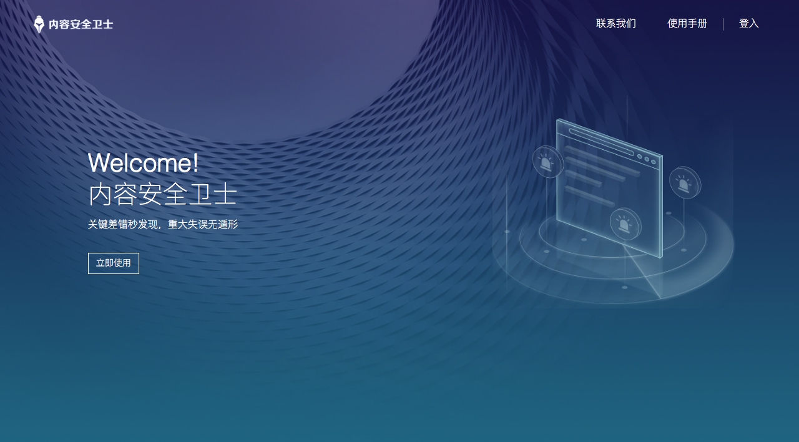

> 出于保密考虑，本文仅展示部分细节

内容安全卫士是广东省数字政府工程下的一个项目，是南方报业传媒集团某业务部门从《南方监测云》独立出来的一个产品，其主要功能是监控并辅助修正政务类网站的内容错误、用法错误。

===

项目由业务部门发起，提出需求并提供原型图和设计资源，研发部门调配1名产品、1名前端和1名后端进行实施。其中我负责整个项目的架构、静态前端、后端及运维，前端同事负责编写前端组件、AJAX 交互以及适配 IE 8。

## 需求与选型

立项之后，业务部门仍未敲定产品细节。这意味着，在开发过程中，**需求必定会有多次调整。**由于竞品开普云筹备 IPO 所带来的压力，业务部门要求项目在短期内上线。

因此技术选型以**又快又稳、保持灵活**为目标。

- 前端需兼容 IE 8，意味着目前主流的可极大提高开发效率的新技术都不能用，比如 Element、Vue.js 等前端框架。最终选用可快速搭建UI且兼容IE 8 的 Bootstrap 3
- 后端框架选用 Laravel 5，可以快速开发出健壮且高可维护性的服务端程序
- 运行环境为 LNMP 组合，其中数据库选用 MySQL 5.6，以保持在不同环境的最大兼容性

## 编码过程

### 数据层

#### 库表结构

数据库是一个系统的根基，根基不正，修建上层就要事倍功半，而且还不稳固。本项目的核心数据都是通过监测云内部API获取，并附加一些信息储存。因此数据库只储存必要的信息，语义化字段名称以增强可读性。

#### 模型

所有业务相关的表均用 Eloquent 模型表示，与数据库直接相关的描述、定义、函数均定义在模型层。

### API

因工作中经常需要在 PHP 层代理 API 请求，故将相关逻辑抽离出来，做成一个 Composer 包发布。

GitHub: [https://github.com/zxz054321/api-proxy](https://github.com/zxz054321/api-proxy)

### Repository层

Repository 是一种设计模式，可以更好地组织代码，对逻辑进行进一步的分层，使项目代码更为清晰。

其中，直接调用南方监测云内部 API 的代码，均封装到 MonitorApiRepository 类中，将 API 调用抽象为类的一个个行为。

在此基础上作进一步封装，把监测站点相关的操作封装为 SiteRepository 类，以便在不同的类、控制器、命令行当中复用。

### 控制器层

控制器是 MVC 类框架的经典层级，前面为保持项目代码简单清晰，主要的业务逻辑都封装在了 Repository 层，因此控制器只需负责响应 HTTP 请求、调用 Repository 获得数据形成响应。

### 路由层

路由负责把请求映射到不同控制器进行处理，并通过路由分组对 Web 页面请求、API 请求作了相应优化。

### 命令层

由于业务部门暂不需要后台，因此用户管理、站点管理都通过命令行实现。命令跟控制器类似，只需负责 CLI 交互并调用相应的 Repository 完成工作。

## 部署到服务器

因改动域名需在集团内跨部门申请，手续繁多。因此研发部门的项目都是用 Nginx 服务器把相应域名的请求映射到不同的服务器上。研发部门没有采购或搭建自动运维、自动部署服务，因此生产服务器是手工安装 LNMP 组合，通过 Git 进行代码同步。

至此，内容安全卫士正式上线，首批用户是广东省人民政府及各省直属单位。