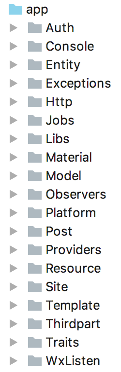

> 出于保密考虑，本文仅展示部分细节

南方政务云 CMS 是研发部门为替换业务部门使用多年的翔宇内容管理系统而发起的项目，并致力于发展为给全省政务部门提供 CMS 服务的一站式平台。

经过一年半的快速发展，CMS 已发展到 2.0 版本，系统复杂度高、功能模块众多。且因一直以来进度都比较赶，研发同事们没时间回头整理代码，现项目代码已存在不同程度的耦合。一次重构很难让 CMS 达到高可读性、高可维护性的效果，需要经过多次重构才能达到较理想的效果。

===

## 关于重构

从 1.0 版本开始，CMS 就已正式上线运行。第一次重构必须遵守以下原则：

1. **不影响线上业务**
2. **不与未结束开发的功能冲突**

综合考虑研发部门的工作量、人力、成本等现实情况，**第一次重构不会让cms脱胎换骨，而是尽量以最低成本达成以下目标：**

1. 增加项目代码可读性，方便未来的开发和重构，为以后的重构打下良好基础
2. 对牵扯范围较小的代码进行整合、优化、重构
3. 避免重复造轮子，尽可能地使用框架机制或开源库

## 关于封装粒度

目前研发部门封装、复用项目的方式是平台化，即将做过的一个个产品集成为一个个平台，平台是目前最小粒度的封装。关于封装粒度，有这样一条规律：**越小粒度的封装，对团队人员水平的要求越高。**按照粒度可大致划分出以下层次，一般粒度越小可复用性越高：

1. Platform
2. SaaS / Service / API
3. Package / Library
4. 多个 Class 组成的 Module
5. Class

## 方案细节

### 架构层

CMS 的开发团队为了部署方便，在一个 Git 仓库里管理所有代码，其中后端代码都写在 Laravel 框架里面，前端（包括 Node.js）代码则在项目中穿插目录存放。在生产环境当中，则由一台服务器运行 PHP + Node.js + MySQL + Redis. 目前的架构我称之为 “集成化架构”，另一种可选的架构方案则是部分 “服务化架构”，下面详解。

目前有一些需要在多个项目当中共用，且通用性较高的功能是写在 CMS 里面的，以用户中心为例。

用户中心由以下组成：

1. MySQL 数据层
2. UserCenter PHP 后端
3. OAuth PHP 后端
4. Vue.js 前端

很多项目都要与用户中心对接，用户中心相当于研发部门手中项目的 SSO（single sign-on）服务。

存在的问题：

1. 强耦合：用户中心有多种环境、语言组成，开发、维护都需要深入到 CMS 的代码和库表结构当中，牵一发而动全身
2. 交接困难：由于项目文档不完善、代码注释较少、命名不太清晰，基本上只有原作者才能对其做修改。如果要让没有一直跟进此项目的人员接手，则要根据 CMS 源码重新摸索学习整个项目的运作过程、功能逻辑，浪费很多时间
3. 职能不明：用户中心未来可能还要承担两步验证、防盗号认证、认证邮件收发、重置密码、第三方账户绑定、个性化等功能，这些功能可能会在所有项目统一启用，这已超出了 CMS 的职能范围

解决方案：

1. 将用户中心从 CMS 中抽离出来，形成一个独立自治的项目，独立部署为一个 SSO 服务
2. SSO 服务仅在职能范围内对外提供服务，如用户相关的页面和API

重构效果：

1. 解耦：经过服务抽离，CMS 系统复杂度下降，代码与库表结构更精简
2. 自主：CMS 存在的问题（宕机、Bug）不会影响抽离出来的服务
3. 灵活：抽离出来的服务职能明确，系统复杂度较低。在抽离的过程中对代码进行优化重整，使得可读性、可维护性大大提高，更易于交接、换人，不再对原作者有强烈依赖
4. 效率：代码量更少、耦合更低，有新需求可快速完成开发

### 框架层

CMS 克隆自 Laravel 官方仓库 5.4 版本，以此为基础进行开发。

存在的问题：

1. 框架版本难升级：新版本的 Laravel 通常会带来一系列实用的新特性、更优雅的设计、更流畅的代码，**可节省大量重复造轮子的时间。**目前如需进行框架版本升级，需要根据升级指南一点点地修改适配
2. 开发体验有待提高：原版 Laravel 并未对 IDE 特性做适配、优化，IDE 无法对一些 Laravel 特性提供自动完成、代码提示、代码追溯、代码重构等功能，开发体验有很大的提升空间，会直接影响开发效率

解决方案：

1. 以 [laravel4china](https://github.com/zxz054321/laravel4china) 项目为 Git 主线

重构效果：

1. [laravel4china](https://github.com/zxz054321/laravel4china) 的 Git 记录会自动处理框架版本升级的细节
2. Laravel 特性将会获得 IDE 的支持，如 model 字段、链式调用、容器、Facades 等

### 数据层

数据库表结构设计的重要性大家都懂，如设计不良，上层代码必定陷入泥潭。

存在的问题：

1. migration 难维护：CMS 已有近 100 张表，migration 文件就有近 150 个，与表并非一一对应
2. migration 可读性差：近 150 个 migration 文件当中，有相当一部分是表结构补丁（新增、修改、删除现存的表的字段），开发中无法通过 migration 文件查看完整的表结构

解决方案：

目前上层代码尚未经过整理，直接重构表结构会牵一发而动全身，并不现实。第一次重构以改进数据层可读性为主。

1. 在 migrations 目录下分出 2 个目录，structures 目录存放包含完整表结构定义的 migration 文件，patches 目录存放用于对数据库进行热更新的表结构补丁
2. 整合所有 migration 文件，将现存的表结构补丁都合并进原始的 migration 文件当中，形成完整的表结构定义存放于 structures 目录
3. 扩展 Laravel 的 `php artisan migrate` 命令，使其支持 `migrations/structures` 和 `migrations/patches` 目录

重构效果：

1. 不影响生产环境
2. 不影响所有同事的开发、测试环境
3. migration 文件包含完整的表结构定义，与数据表一一对应，migration 可读性大大提高
4. 表结构补丁独立存放，开发、维护、追溯都很方便

### 业务层

业务代码目录结构如图所示：

存在的问题：

1. 非标准化技术：开发团队对 Laravel 框架了解有限，很多框架内置的功能特性放着没用，自己重复造了轮子。如事件机制、OAuth、用户认证、权限控制等。由此带来的问题有：开发人员重复造轮子浪费时间、未来接手的开发人员反复学习非标准的自造轮子，浪费双倍时间
2. 不成熟的设计：开源框架内置的功能特性和开源库经过众多开发者不同场景的充分测试，其通用性、可靠性都比较有保证，针对特定工作任务的自造轮子，通常难以考虑周全、测试周到，存在各种各样的问题
3. 命名不规范：不规范的命名会给人带来困惑，比如混用的名词单复数（Exceptions、Resource）、含义不明确的缩写（Wx、$m）
4. 文件结构混乱：文件的层级划分不清晰也会给人带来困惑，原本 app 目录下的子目录是分层划分的，比如 Providers 层、Http 层、Jobs 层……目前划分标准不得而知

解决方案：

1. 使用标准技术：技术的选择上应遵循 **“框架内置第一，开源库第二，实在无法满足需求再造轮子”** 的原则。开发团队要克服 “文档恐惧症” 和 “自己造的轮子总是最好的” 错觉，在动手造轮子之前先确认一下是否存在别人造好的轮子
2. 使用 Repository 设计模式
3. 规范命名

重构效果：

1. 标准化技术：节省了重复造轮子、反复学习自造轮子的双重时间，掌握标准技术的开发人员均可快速上手
2. 文件目录组织有序，划分清晰
3. 命名表意明确，用词规范

