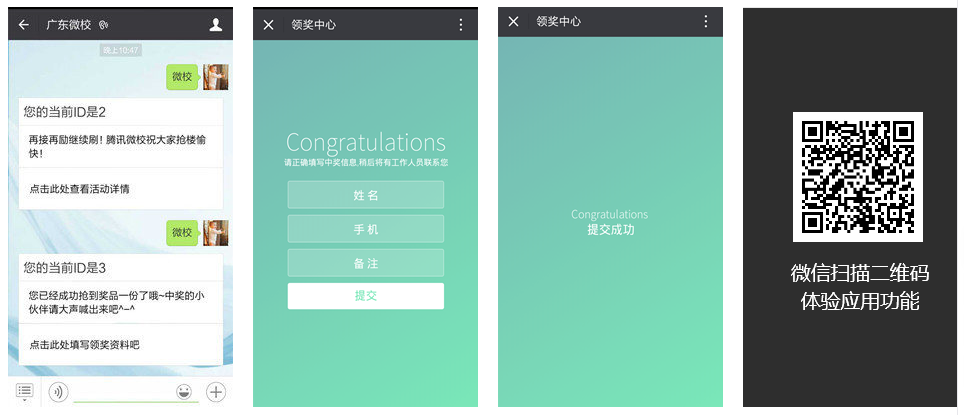

抢楼是腾讯微校的首批应用，是今天微校应用广场的前身。迄今为止，抢楼服务了国内多家政府部门、事业单位、央企、国企以及民企。上至国务院某办公室，下至普通的初创企业、校园运营者都有在用。

===

## 典型客户

国务院某办公室、中国移动、中国农业银行、腾讯、万科、VIVO、中山电视台、雪花啤酒、各大高校……

目前接近5000个公众号正在使用。

## 官网

腾讯微校：[http://weixiao.qq.com/](http://weixiao.qq.com/)